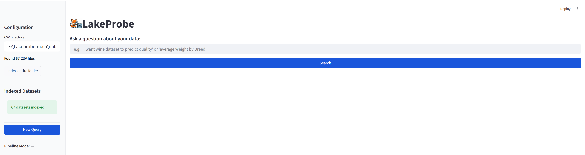

<p align="center">
  
</p>

<h1 align="center">LakeProbe</h1>
<p align="center"><b>Evidence-Based Natural Language Query & Data Discovery for Schema-Less Data Lakes</b></p>

<p align="center">
  <a href="#quick-start">Quick Start</a> •
  <a href="#architecture">Architecture</a> •
  <a href="#benchmark-results">Benchmarks</a> •
  <a href="#demo-scenarios">Demo Scenarios</a> •
  <a href="#citation">Citation</a>
</p>

---

<p align="center">
  
</p>

---

## Overview

LakeProbe answers analytical questions over CSV data lakes **without any schema knowledge**. Unlike Text2SQL systems that require database DDL as input, LakeProbe works entirely from physical evidence — column statistics, data-type profiles, value distributions, and sample values — to bind natural language queries to real columns and execute them via DuckDB.

The core insight is a **schema-agnostic intent representation**: the LLM is asked only to extract semantic hints (e.g., `{metric: "alcohol", dim: "quality", agg: avg}`), never to name or guess columns. All column-to-hint binding is done by the Evidence Fusion Engine using verifiable signals, producing a full audit trail alongside every result.

### Why LakeProbe?

| | Text2SQL (BIRD / Spider) | LakeProbe |
|---|---|---|
| **Schema prerequisite** | Full DDL required | ✅ None |
| **LLM output** | SQL with column names | ✅ Schema-agnostic intent |
| **Token cost scaling** | O(\|schema\|) — grows with table count | ✅ O(\|query\|) — constant |
| **Hallucination defense** | None | ✅ Three-zone threshold + hard type guard |
| **Fabricated columns** | Possible | ✅ Zero (physically grounded) |
| **Explainability** | SQL only | ✅ Full audit trail with evidence chain |
| **Multi-lingual support** | Rare | ✅ Chinese–English cross-lingual bridge |

---

## Quick Start

### 1. Install Dependencies

```bash
pip install -r requirements.txt
python -c "import nltk; nltk.download('wordnet'); nltk.download('omw-1.4')"
```

### 2. Configure LLM (Optional)

Edit `config.py` — or skip entirely to run in pure IR mode (sub-300 ms, no API calls):

```python
# GPT-4o-mini
LLM_MODEL    = "gpt-4o-mini"
LLM_API_BASE = "https://gateway.goapi.ai/v1"
LLM_API_KEY  = "your-key"

# DeepSeek-V3.2
LLM_MODEL    = "deepseek-chat"
LLM_API_BASE = "https://api.deepseek.com/v1"
LLM_API_KEY  = "your-key"

# Gemini-2.5-Pro
LLM_MODEL    = "gemini-2.5-pro"
LLM_API_BASE = "https://generativelanguage.googleapis.com/v1beta/openai/"
LLM_API_KEY  = "your-key"

# No LLM — pure retrieval mode
LLM_API_KEY  = ""
```

### 3. Add Your CSV Data

Place any CSV files in `data/csv/`. LakeProbe auto-profiles them on first load — no DDL, no table registration.

### 4. Launch the UI

```bash
streamlit run main.py
```

### 5. Run Benchmarks

```bash
# Internal benchmark (25 Query + 25 Discovery tasks, 67 datasets)
python benchmarks/run_benchmark.py --csv-dir data/csv

# BIRD Mini-Dev benchmark (200 questions, 79 tables, 11 databases)
python benchmarks/setup_bird.py         --bird-dir path/to/bird_data
python benchmarks/run_bird_benchmark.py --csv-dir  path/to/bird_csv_export
```

---

## Architecture

LakeProbe is a six-stage pipeline. Each stage is independently auditable.

```
User Natural Language Query
         │
         ▼
┌─────────────────────┐
│   Intent Parser     │  LLM (16-shot) or rule-based fallback
│      (PartA)        │  Output: {metric_hints, dim_hints, agg, filters}
└────────┬────────────┘  — schema-agnostic; no column names produced
         │
         ▼
┌─────────────────────┐
│   Domain Router     │  rule / embedding / LLM  (15 domains, auto-extensible)
│                     │  Output: domain label + confidence score
└────────┬────────────┘
         │
         ▼
┌─────────────────────┐
│  Hybrid Retriever   │  Sparse: lexical + alias + role + dtype + stats
│      (PartB)        │  Dense:  sentence-transformers or TF-IDF SVD
└────────┬────────────┘  Fusion: weighted sum + RRF → ranked candidates
         │
         ▼
┌─────────────────────┐
│  Evidence Fusion    │  1. Candidate merge (PartA hints × PartB results)
│     Engine          │  2. Hard constraint filter (type guard — no LLM)
│                     │  3. Multi-signal rescore (5-weight combination)
│                     │  4. Three-zone routing: Accept / Uncertain / Reject
│                     │  5. Override boost (user correction persistence)
│                     │  6. Binding selection + evidence chain assembly
│                     │  7. Executable plan construction (with auto-JOIN)
└────────┬────────────┘
         │
         ▼
┌─────────────────────┐
│   Plan Optimizer    │  Histogram-based cost model, sampling trigger,
│                     │  5 rewrite rules (filter pushdown, TopN fusion, …)
│                     │  + tiktoken-precise token accounting
└────────┬────────────┘
         │
         ▼
┌─────────────────────┐
│   DuckDB Executor   │  Single-table or auto-discovered multi-table JOIN
│   + Audit Trail     │  Full audit: intent → candidates → binding → SQL → result
└─────────────────────┘
```

**Pipeline formula:** `(Q, P, D) → C → B → E → R`

| Symbol | Component | Description |
|--------|-----------|-------------|
| Q | Query Intent | Structured intent from PartA parser |
| P | Profile Cards | Per-column statistics (dtype, min/max, unique_rate, histogram, samples) |
| D | Dataset Cards | Per-dataset metadata (domain, measures, dimensions, summary embedding) |
| C | Candidates | Hybrid sparse + dense retrieval results |
| B | Binding | Evidence-based column binding with three-zone confidence labels |
| E | Executable Plan | DuckDB operator plan with cost estimate |
| R | Result + Audit | Query result with full, reproducible evidence trail |

---

## Key Components

### PartA — Schema-Agnostic Intent Parser

The LLM receives a 16-shot prompt and is instructed to produce **semantic keywords only** — never column names. This eliminates the hallucination surface present in Text2SQL, where the LLM must guess column names from memory or DDL.

Supported intent types: `aggregate`, `trend`, `ranking`, `filter`, `comparison`, `distribution`, `correlation`, `lookup`. A regex + keyword rule engine serves as the fallback when no LLM is configured, preserving sub-300 ms latency in pure IR mode.

### PartB — Hybrid Sparse-Dense Retriever

Two-stage retrieval:

1. **Dataset retrieval** — sparse scoring (keyword overlap, alias expansion, domain label) combined with dense semantic similarity against pre-computed dataset summary embeddings.
2. **Column retrieval** — five sparse signals (lexical match, alias match, role match, dtype compatibility, stats fingerprint) fused with dense embedding cosine similarity via Reciprocal Rank Fusion.

The embedding backend is configurable: `sentence-transformers/all-MiniLM-L6-v2` (default), OpenAI `text-embedding-3-small`, or a lightweight TF-IDF + SVD fallback requiring no GPU and no external API.

### Evidence Fusion Engine

The system core. Given ranked candidates and a parsed intent, it:

- **Merges** PartA semantic hints with PartB physical candidates.
- **Hard-filters** via type constraints: text columns cannot be aggregated as metrics; pure-measure numeric columns cannot serve as dimensions; non-datetime columns cannot serve as time axes. These rules are physical and require no LLM.
- **Rescores** survivors with a five-weight signal combination:
  `lexical (0.25) · semantic (0.30) · role match (0.20) · dtype compatibility (0.15) · top-k evidence (0.10)`.
- **Routes** each binding through three zones:
  - **Accept** (≥ 70%) — auto-bound with evidence tag.
  - **Uncertain** (30–70%) — surfaced for optional user confirmation.
  - **Reject** (< 30%) — discarded; reason logged to audit trail.
  - Thresholds adapt dynamically: when the top-2 candidate scores are within 5% of each other, the accept threshold rises by 10% to avoid overconfident bindings on ambiguous queries.
- **Applies user overrides** (`OverrideStore`) as a score bonus, applied after hard filtering — so corrections cannot bypass physical type constraints.
- **Constructs** an `ExecutablePlan` with automatic cross-dataset JOIN discovery (MinHash/LSH, ≥50% value-overlap threshold required).

### Plan Optimizer

- **Cost model** — equi-depth histogram-based selectivity estimation for range and equality predicates; falls back to value-count lookup for categorical columns.
- **Sampling trigger** — when cost confidence is low, fires a lightweight `TABLESAMPLE(1%)` probe before full execution.
- **Five rewrite rules** — filter pushdown, projection pushdown, predicate simplification, TopN fusion (SORT + LIMIT → DuckDB window), and deduplication elimination.
- **Runtime feedback cache** — records actual vs. estimated row counts; used to calibrate future cost estimates on the same dataset.
- **Token tracker** — uses `tiktoken` for precise per-request token counting. Also constructs the equivalent Text2SQL prompt (full DDL) to produce real apples-to-apples token saving measurements.

### Dirty Data Handling (6 Layers)

| Layer | Mechanism | LLM required? |
|-------|-----------|:---:|
| Role Inference | Infer MEASURE / DIMENSION / TIME from dtype + cardinality stats | No |
| Abbreviation Expansion | 80+ hand-curated mappings (`qty → quantity`, `temp → temperature`, …) | No |
| Sample Value Inference | Detect semantic patterns (currency codes, ISO dates, gender flags) from actual cell values | No |
| Stats Fingerprint | `unique_rate`, `min/max`, `n_unique` discriminate column purpose without relying on column names | No |
| Cross-lingual Bridge | Chinese–English synonym matching via extended alias lexicon | No |
| LLM Alias Generation | Per-dataset synonym expansion; result cached to disk and reused on subsequent loads | Yes (once) |

### Join Discovery

Offline: builds MinHash sketches (128 hash functions, LSH with 16 bands) over identifier and dimension columns across all datasets. Online: given a target column, returns join candidates sorted by Jaccard overlap. Pairs with ≥50% overlap are automatically inserted into the execution plan as `LEFT JOIN` operators.

### Interactive Override Loop

Users can correct any binding decision in the UI. Corrections are persisted as `OverrideRule` records (semantic hint → correct column, scoped to dataset). On subsequent queries, matching overrides receive a score bonus in the fusion stage — while hard type constraints remain enforced.

---

## Three Operating Modes

| Mode | Example trigger | What it does |
|------|----------------|--------------|
| **Ask** | `"average Trip_Price by Weather"` | NL → binding → SQL → result with full audit trail |
| **Discover** | `"I want wine data to predict quality"` | Returns ranked datasets + column recommendations, generates a desired schema |
| **Enrich** | Automatic on first CSV load | Profiles columns, builds embeddings, discovers joins, generates LLM aliases |

---

## Benchmark Results

> All numbers are read directly from benchmark result files in `benchmarks/results/`, produced by actual runs on the authors' machine. No post-hoc adjustments were made.

### Internal Benchmark — 67 Datasets, ~6.4M Rows

25 analytical queries × 25 data discovery tasks, spanning 10 domains: wine, housing, taxi, medical, MBA, insurance, IoT, energy, animal, e-commerce.

#### Query Mode — Multi-Model Comparison

| Metric | GPT-4o-mini | DeepSeek-V3.2 | Gemini-2.5-Pro |
|--------|:-----------:|:-------------:|:--------------:|
| **Binding Accuracy** | **76%** | **80%** | **80%** |
| Metric Accuracy | 84% | 88% | 88% |
| Dimension Accuracy | 92% | 92% | 92% |
| Table Selection (strict) | 56% | 56% | 56% |
| Table Selection (any top-K) | 64% | 68% | 68% |
| Type-Mismatch Blocked | 4 | 4 | 4 |
| Token Saving vs Text2SQL | **+69.0%** | **+64.8%** | **+56.3%** |
| Avg Latency | 5,327 ms | 7,712 ms | 10,317 ms |

#### Discovery Mode

| Metric | GPT-4o-mini | DeepSeek-V3.2 | Gemini-2.5-Pro |
|--------|:-----------:|:-------------:|:--------------:|
| Dataset Precision | 60.0% | 64.0% | 65.3% |
| Column Precision | 76.0% | 68.0% | 67.3% |
| Coverage | 88.0% | 86.0% | 90.0% |

#### Token Cost

Average Text2SQL tokens (67 tables, full DDL): **4,872**. LakeProbe's token cost is constant regardless of table count.

| Model | LakeProbe Tokens | Text2SQL Tokens | Saving | Monthly LP | Monthly T2S | Monthly Saving |
|-------|:----------------:|:---------------:|:------:|:----------:|:-----------:|:--------------:|
| GPT-4o-mini | 1,510 | 4,872 | +69.0% | $88 | $217 | $129 |
| DeepSeek-V3.2 | 1,715 | 4,872 | +64.8% | $151 | $374 | $223 |
| Gemini-2.5-Pro | 2,130 | 4,872 | +56.3% | $1,358 | $2,037 | $679 |

---

### BIRD Mini-Dev Benchmark — 200 Questions, 79 Tables, 11 Databases

BIRD is the premier structured-data NL benchmark, featuring dirty data, external knowledge requirements, and multi-table JOINs. LakeProbe is evaluated **without any access to database schemas or DDL**.

#### Overall Results

| Metric | Value |
|--------|:-----:|
| **Table Selection (strict)** | **87.5%** |
| **Table Selection (top-3 candidates)** | **94.5%** |
| **Database Hit Rate** | **93.0%** |
| **Avg Column Precision** | **87.5%** |
| Fabricated Columns | **0** |
| Type-Mismatch Candidates Blocked | **578** (across 84 queries) |

#### By Difficulty

| Difficulty | N | Strict | Top-3 | DB Hit | Col Precision |
|------------|:-:|:------:|:-----:|:------:|:-------------:|
| Simple | 66 | 81.8% | 92.4% | 89.4% | 90.5% |
| Moderate | 96 | 88.5% | 95.8% | 93.8% | 88.4% |
| **Challenging** | **38** | **94.7%** | **94.7%** | **97.4%** | 79.8% |

> **Notable finding:** Challenging questions achieve the *highest* strict accuracy (94.7%), because they contain richer and more discriminative keywords that strengthen LakeProbe's retrieval signal. This is the inverse of the typical Text2SQL difficulty curve.

#### By Database

| Database | N | Strict | Top-3 | DB Hit | Col Precision |
|----------|:-:|:------:|:-----:|:------:|:-------------:|
| debit_card_specializing | 30 | 83.3% | 86.7% | 90.0% | 83.8% |
| european_football_2 | 51 | 94.1% | 96.1% | 98.0% | 88.5% |
| formula_1 | 21 | 76.2% | 90.5% | 90.5% | 90.7% |
| student_club | 48 | 85.4% | **100.0%** | 89.6% | 92.2% |
| thrombosis_prediction | 50 | 90.0% | 94.0% | 94.0% | 82.7% |

---

### Token Cost Scaling

LakeProbe token cost is **O(|query|) = constant**. Text2SQL token cost is **O(|schema|) = linear in table count**.

| Tables | Text2SQL Tokens | LakeProbe Tokens | Saving |
|:------:|:---------------:|:----------------:|:------:|
| 1 | 607 | 1,510 | −149% |
| 20 | 1,693 | 1,510 | +11% |
| 67 | 4,872 | 1,510 | **+69.0%** |
| 100 | 6,267 | 1,510 | +76% |
| 500 | 29,139 | 1,510 | +95% |
| 1,000 | 57,729 | 1,510 | +97% |

> **Crossover point:** LakeProbe becomes cheaper than Text2SQL at ~20 tables. At enterprise scale (500+ tables) it reduces LLM token spend by 95%+.

---

## Hallucination Guard

LakeProbe's type-mismatch guard operates at the physical column level, independently of the LLM:

- **Zero fabricated columns** across all benchmarks. Every bound column is sourced from the real indexed schema.
- **578 invalid binding candidates blocked** on BIRD Mini-Dev, across 84 queries. Representative blocked reasons:
  - `"Cannot aggregate text column 'Diagnosis' as metric (agg=MAX)"`
  - `"Pure measure column 'driverId' not suitable as dimension"`
  - `"Non-numeric column 'event_date' incompatible with sum"`
- Hard constraint rules require no LLM call and cannot be bypassed by user overrides.

---

## Demo Scenarios

The following scenarios are designed for the VLDB 2026 demo session. All run on the included 67-dataset lake with no additional setup beyond `streamlit run main.py`.

**Scenario 1 — Zero-Schema Query**
Enter `"average alcohol by quality"` with no LLM configured. LakeProbe profiles the wine CSVs on the fly, routes to the correct dataset, binds `alcohol` and `quality` from physical evidence alone, and returns a grouped result with full binding trace.

**Scenario 2 — Hallucination Interception**
Enter `"maximum PTRATIO grouped by PTRATIO"`. The type guard classifies `PTRATIO` as a pure measure column and blocks it from the dimension slot. The result panel shows the blocked candidate with its rejection reason, and the system falls back cleanly.

**Scenario 3 — Data Discovery**
Enter `"I want taxi trip data with price and weather"`. Discover mode returns ranked datasets, generates a desired schema, and surfaces join candidates between the trip and weather tables via MinHash overlap.

**Scenario 4 — Interactive Correction**
Submit any query, then use the correction panel to remap a hint to a different column. The override persists across the session and boosts the corrected column on subsequent queries — while the hard filter still blocks any physically invalid assignment.

**Scenario 5 — Token Cost Comparison**
Open the audit trail for any query. The optimizer panel displays the exact LakeProbe token count (via tiktoken) alongside the equivalent Text2SQL prompt token count, demonstrating the constant-vs-linear scaling claim with real numbers.

**Scenario 6 — Cross-lingual Query**
Enter `"按地区统计销售额"` (Chinese: "total revenue by region"). The cross-lingual bridge maps the Chinese terms to English aliases; the pipeline then proceeds identically to an English query.

---

## Project Structure

```
Lakeprobe-main/
├── main.py                    # Streamlit UI + FastAPI entry point (1,305 lines)
├── config.py                  # All thresholds, weights, paths (116 lines)
├── requirements.txt
├── core/
│   ├── parta_parser.py        # Intent parser: LLM 16-shot + rule fallback (578 lines)
│   ├── retriever.py           # Hybrid sparse + dense two-stage retrieval (572 lines)
│   ├── fusion_engine.py       # Evidence fusion + three-zone routing (541 lines)
│   ├── plan_optimizer.py      # Cost model + 5 rewrite rules + token tracker (882 lines)
│   ├── executor.py            # DuckDB single-table + auto-JOIN execution (433 lines)
│   ├── schema_generator.py    # Discovery mode: desired schema + IR (456 lines)
│   ├── embedding_engine.py    # sentence-transformers / TF-IDF SVD backends (454 lines)
│   ├── domain_router.py       # 15-domain classifier, 3 routing modes (446 lines)
│   ├── knowledge_base.py      # Synonyms + 80+ abbreviation mappings (585 lines)
│   ├── join_discovery.py      # MinHash / LSH offline sketch + online lookup (381 lines)
│   ├── override_store.py      # User correction persistence + boost logic (322 lines)
│   ├── profiler.py            # DuckDB CSV profiler + role inference (305 lines)
│   ├── dataset_card.py        # Dataset-level metadata cards (291 lines)
│   ├── llm_alias.py           # LLM alias generation, cached per dataset (268 lines)
│   ├── models.py              # Pydantic v2 data models (251 lines)
│   └── audit.py               # Full audit trail serialization (152 lines)
├── benchmarks/
│   ├── run_benchmark.py       # Internal benchmark runner (25Q + 25D)
│   ├── run_bird_benchmark.py  # BIRD Mini-Dev runner
│   ├── setup_bird.py          # BIRD SQLite → CSV export tool
│   ├── bird_mini_dev_500.jsonl
│   └── results/               # All benchmark JSON + CSV result files
└── data/
    ├── csv/                   # Drop your CSV files here
    ├── profile_cards/         # Auto-generated column profile JSONs
    ├── dataset_cards/         # Auto-generated dataset metadata
    ├── column_index/          # Sparse column search index
    ├── vector_index/          # Dense embedding vectors
    └── alias_cache/           # LLM alias cache (one JSON per dataset)
```

**Total: 17 modules, 8,338 lines of code**

---

@inproceedings{lakeprobe2026,
  title     = {LakeProbe: Evidence-Based Natural Language Query Engine for Schema-Less Data Lakes},
  booktitle = {Proceedings of the VLDB Endowment (Demo Track)},
  year      = {2026},
  author    = {Li, Kaiyu and An, Jia and Sun, Qi}
}

---

## Authors

Kaiyu Li · Jia An · Qi Sun
---

## License

Research use only. Contact authors for commercial licensing.
